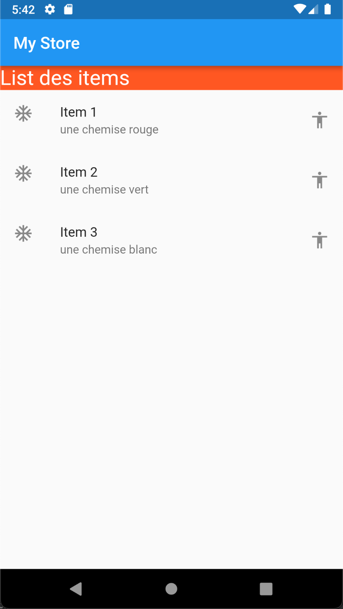
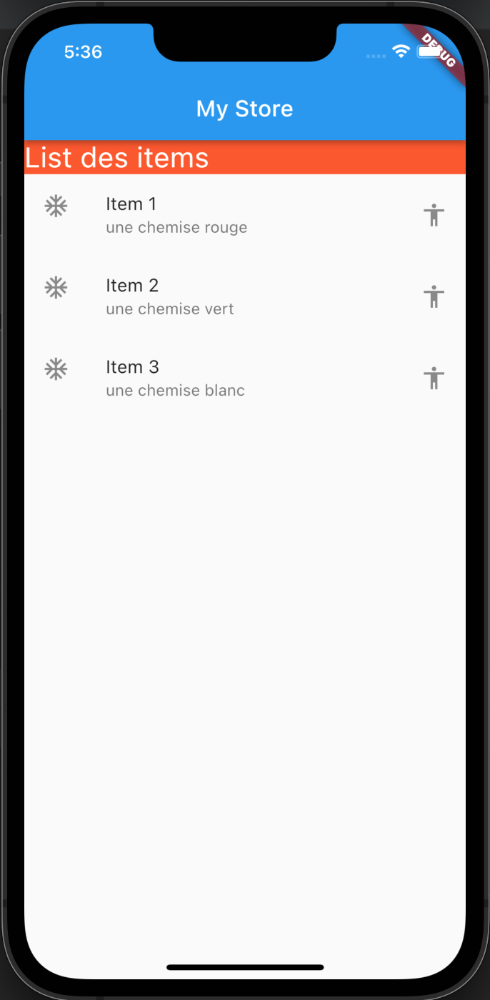
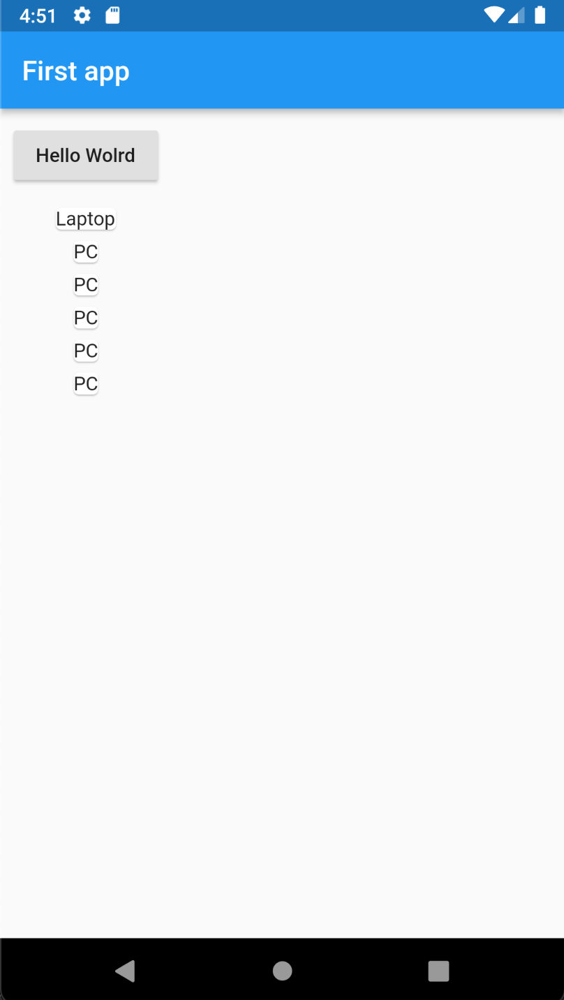
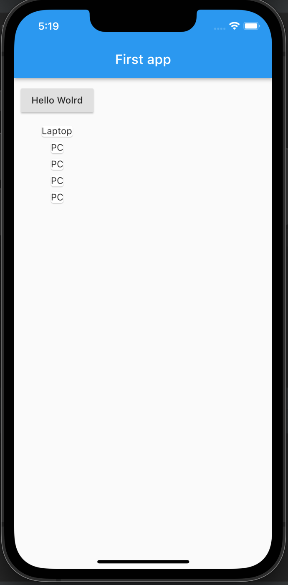

# First Application Flutter

## Description
In this application, i try the use ListView and by using both StatefulWidget and statelessWidget.Application

## Screenshot

### stateless

### stateFul

